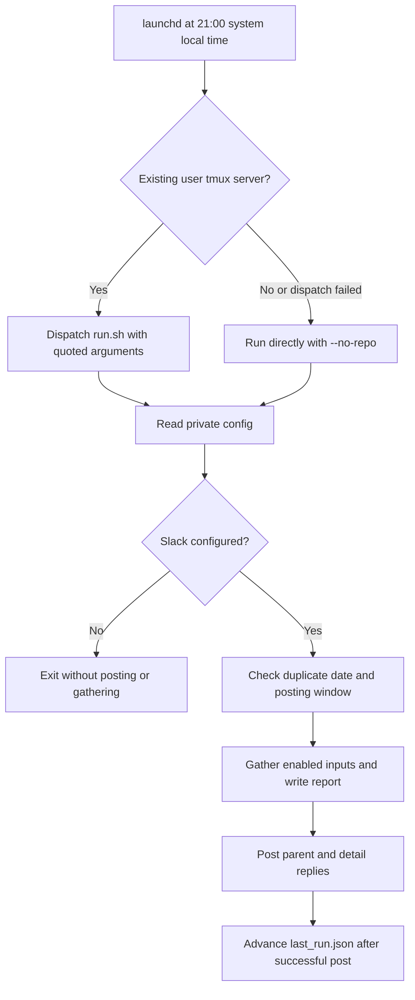

# Daily recap

Build one Slack post with product changes, personal activity, and a Sunsama plan. Each input is optional. The public template has no accounts, channel, repository, or private data paths.

## Runtime layout

```text
components/daily-recap/                 Versioned source, package manifest, lock, tests
            |
            | install.py --write (explicit)
            v
~/.prime/agent/daily-recap/              Outside Documents
  bin/                                 Copied Python, JavaScript, shell helpers
  package.json + package-lock.json      Pinned Sunsama dependency
  node_modules/                        Installed separately with npm ci
  config.env                           Private bash config, never replaced
  state/                               Feature list, last post, Sunsama/token cache
  reports/                             Markdown reports and diagnostic files
  logs/                                Dispatch and run logs
```

## Install or refresh

Run from the repository root. Python 3.9 or newer is required. Node 22.13.0 or newer is required only for Sunsama and component tests.

1. Preview the files and launchd definition. This creates no files and starts no services.

   ```bash
   python3 -B components/daily-recap/install.py
   ```

2. Review the JSON plan. Set a different location or schedule with `--runtime`, `--plist`, `--hour`, and `--minute`. Use `--node-bin-dir` to set launchd's Node/Prime Agent search directory.
3. Repeat the same arguments with `--write` to stage the files. The installer never reads or changes an existing `config.env`. It preserves state, reports, logs, `bin/unslop.md`, and installed dependencies. Each generated file is replaced atomically; the whole refresh is not a transaction.

   ```bash
   python3 -B components/daily-recap/install.py --write
   ```

4. Edit the external `~/.prime/agent/daily-recap/config.env`. Keep it private. For a new file, the installer sets mode `600`. Existing file bytes and permissions remain unchanged.
5. If you enable Sunsama, install its pinned dependency in the runtime, not in `bin`.

   ```bash
   npm ci --prefix "$HOME/.prime/agent/daily-recap" --ignore-scripts --no-audit --no-fund
   ```

The shell installer is an alias for `install.py`. Neither command calls `launchctl`, installs dependencies, reads credentials, grants permissions, or posts a message. Source code and runtime paths must not overlap. Runtime paths under `Documents` are rejected.

The generated plist defaults to `~/Library/LaunchAgents/com.sieun.daily-recap.plist`. Loading or reloading it is a separate operator action. Review the plist and config before that action. The installer does not mask a failed write as a successful service load.

## Private configuration

`config.example.env` lists all recap settings. `run.sh` sources `config.env` as bash code, so use only trusted config and quote paths with spaces.

| Input | Keys that enable it | Other settings |
| --- | --- | --- |
| Slack posting | `SLACK_BOT_TOKEN` and `SLACK_CHANNEL`, or `--channel` | No default channel. Missing keys exit before gathering data. |
| Product changes and model summary | `REPO_DIR` and `LLM_ENABLED=1` | `GITHUB_REPO`, `PRODUCT_CONTEXT`, `WIKI_PAGES_JSON`, `LLM_THINKING`, `LLM_TIMEOUT_S` |
| Token usage | `TOKSCALE_GRAPH` | `TOKENS_URL` is an optional display link. |
| Drifty | `DRIFTY_DB` and `DRIFTY_SLUG` | `FOCUS_URL` is an optional display link. |
| Sunsama | `SUNSAMA_COOKIE_DB` | `SUNSAMA_URL` is an optional display link. |
| Runtime tools | Tools on `PATH` | `NODE_BIN_DIR`, `PYTHON_BIN` |
| Date/time | `DAILY_RECAP_TZ` defaults to `UTC` | Set this to the timezone used for your recap. |
| Writing rules | Optional external `UNSLOP_RULES` path | Falls back to an existing runtime `bin/unslop.md`; no skill file is copied automatically. |

`PRODUCT_CONTEXT` is plain text for the model. `WIKI_PAGES_JSON` is a bash-quoted JSON array of repository-relative HTML paths, used to seed an empty feature list. For example, `WIKI_PAGES_JSON='["docs/product.html"]'`. No repository-specific paths are built in.

Sunsama uses only the explicit cookie database. Sign in to the desktop app yourself. The helper copies that database before reading it. Missing, expired, or encrypted cookies produce errors. It never reads Keychain. The standalone Drifty exporter requires an explicit `--db` and `--slug`, or the matching environment keys. Its optional `--upload` action also requires an explicit Convex URL and secret. The recap does not call that upload action.

## Run and schedule



| Condition | Result |
| --- | --- |
| New public config | No service input, no Slack post. |
| `run.sh --dry-run` | Prints a preview; does not post or write runtime files. Enabled inputs still run, including model calls. |
| Same date already posted | Skips unless `--force` is set. |
| Run before 06:00 | Uses the previous local date unless `--today` is set. |
| Run from 06:00 through 20:29 | Skips unless `--force` or `--today` is set. |
| A section fails | Includes its error in the parent/thread report; other sections continue. |
| Slack post fails | Returns nonzero; does not advance the last-post marker. Section caches may already have changed. |
| No existing tmux server | Runs without the repository section; never starts a tmux server or grants TCC permissions. |

The launchd schedule uses the machine's local timezone, independent of `DAILY_RECAP_TZ`. The default remains 21:00. `RunAtLoad` stays false. The entry script reports successful dispatch, not completion of the detached tmux job. Read its run log for the final exit code. The fallback returns the actual job exit code.

```bash
bash "$HOME/.prime/agent/daily-recap/bin/run.sh" --help
bash "$HOME/.prime/agent/daily-recap/bin/run.sh" --dry-run
```

A scheduled configured post retains the wake-from-sleep network check, at most 30 attempts with 30-second waits. Dry runs skip that check. Exhaustion returns an error instead of hiding it. A partial Slack thread failure can leave a parent post without every reply; retrying can create a duplicate parent. Concurrent triggers do not have a lock. These are existing limits.

## Dependencies and verification

| File | Parsed dependencies and external actions |
| --- | --- |
| `install.py` | Python standard library, local source reads, explicit file writes. No subprocess calls. |
| `daily_recap.py` | Python standard library including `zoneinfo`; optional `git` and `prime-agent -p` child processes; Node Sunsama helper; Slack HTTPS API. |
| `drifty_focus_export.py` | Python standard library including SQLite; explicit local read-only database; optional standalone Convex HTTPS upload. |
| `sunsama_fetch.mjs` | Node built-ins including `node:sqlite`; `sunsama-api@0.14.0` and its locked transitive dependencies; explicit cookie read and Sunsama HTTPS queries. |
| `run.sh` | Bash, date, configured Python; curl and sleep only for configured non-preview posts. |
| `launchd_entry.sh` | Bash, date, mkdir; optional existing tmux server. |
| `install_daily_recap_agent.sh` | Bash and Python; forwards arguments without changing them. |

No source checkout, global `NODE_PATH`, external application script, Keychain command, or third-party Python package is required. `prime-agent` must already have the user's model configuration when product summaries are enabled.

```bash
npm ci --prefix components/daily-recap --ignore-scripts --no-audit --no-fund
npm test --prefix components/daily-recap
```

The fixture suite checks native help and parsers, generated runtime operation after removing its source copy, real runtime dependency resolution, disabled public defaults, config/state preservation, read-only SQLite fixtures, the full Sunsama helper with a stub API client, failure paths, scheduling rules, and shell argument quoting. Tests use temporary homes and deny/stub external commands and network access. They do not validate live Slack, Sunsama, Drifty, model access, or macOS TCC grants.
