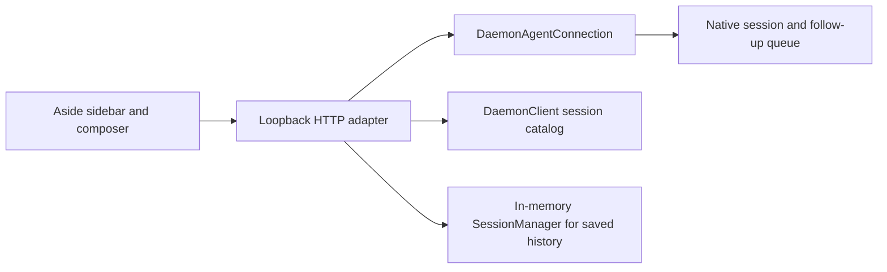

# Saved history and agent chat

`/what-did-i-say` opens saved questions and final responses in Aside. It reads the active conversation branch, oldest first, including messages before compaction.

The snapshot command does not call a model, change saved history, replay tools, or create a history file. `/agent-chat` also lets you send messages through native Prime Agent sessions. This package is separate from pi-pool.

## Chat with sessions and agents

Run `/agent-chat` to open the interactive view in Aside. After updating this source, run `/reload` once in the terminal to register the new command.

```text
Sessions | Agents       Selected conversation
Search                  Saved messages and live replies
Conversation list       Message composer          Send
```

- Switch between daemon-visible sessions and agents in the sidebar. This changes the browser view, not the terminal's selected session. Private client-owned RPC sessions keep their native visibility limits.
- Send with Enter. Shift+Enter adds a line. Busy sessions receive native follow-up messages after their current turn.
- Saved sessions are readable. Resume them in Prime Agent before sending; the browser does not create or resume workers.
- Drafts stay in browser memory for each session. Switching preserves them. Reloading or closing the tab discards them.
- Acceptance means Prime Agent accepted the message, not that the agent completed its work. An uncertain send keeps the draft and never resends automatically.
- Close chat stops the local browser connection. It does not stop agents. An inactive listener expires after 30 minutes without requests.
- Running `/agent-chat` again closes the previous listener owned by that extension. Existing tabs then become disconnected.

The extension uses the default native daemon socket. If you launch with a custom `--daemon-socket`, also pass `--agent-chat-socket` with the same path.

### Native architecture



The package adds a browser page and an HTTP adapter. Prime Agent still owns session identity, saved history, live state and prompt admission. It adds no database, agent runner, copied session files, runtime patches or frontend framework.

`DaemonAgentConnection` reads the full native branch and current streaming message. The view omits thinking, tools and custom agent-to-agent messages. User and assistant text use the existing inert Markdown renderer. Saved reads use `SessionManager.inMemory()` and `setSessionFile()` because `SessionManager.open()` can repair or migrate files on disk.

The browser requests one selected transcript every two seconds and the session list every ten seconds while visible. It ignores responses for an older selection. The adapter keeps at most four native viewer connections, then disposes unused ones. Closing viewers does not kill or take ownership of sessions.

Before sending, the adapter resolves the selected saved session ID in the native catalog and checks the live session header. Prime Agent 0.9.4 has no atomic expected-session-ID condition for prompts. Do not replace that same worker's session in the terminal at the instant you send from the browser. A completed replacement is detected, but a replacement between the native identity check and admission can race.

### Local access and limits

The listener binds only to `127.0.0.1`. The random URL grants read access. Writes also require a separate per-listener token, the exact Origin and Host, and JSON. Cross-site requests are rejected. Do not share the URL. Other processes running as your user are outside this protection.

The page's fixed script and stylesheet hashes restrict its Content Security Policy. It loads no outside resources. Transcript HTML, links and image destinations stay inert. Chat responses use `Cache-Control: no-store`. Browser-managed copies and screenshots can still remain.

Each send carries a request ID. Repeated requests with the same ID and payload reuse the admission result, including uncertain failures. A listener accepts at most 256 distinct send requests; reopen chat to reset it. Messages are limited to 32,000 characters. There is no automatic send retry or daemon recovery loop.

The browser does not implement interactive extension dialogs, model settings, new sessions, deletion or terminal commands. Use Prime Agent for those controls.

### Chat source map

- `extension/chat.ts` registers `/agent-chat`, opens Aside and closes its listener on native session shutdown.
- `src/chat-backend.ts` adapts public Prime Agent session APIs.
- `src/chat-server.ts` exposes only list, read, message and close routes.
- `src/chat-page.ts` contains the page, browser state and fixed CSP hashes.
- `src/page.ts` shares the existing inert Markdown renderer.
- `test/chat-server.test.ts` checks loopback HTTP, request limits and message authorization.
- `test/chat-native.test.ts` exercises the installed daemon with isolated synthetic sessions and a test provider.

## Read the snapshot

Run `/what-did-i-say` in Prime Agent on macOS with Aside.app installed. The command uses `/usr/bin/open -b at.studio.AsideBrowser` to open the generated local URL in Aside. It does not use the default browser or a temporary Aside REPL session.

Each question group shows its latest marked final response. Expand **Earlier final responses** to read previous marked finals. Expand **Injected skill instructions** to read a saved skill body. Skill arguments stay beside the `/skill:name` label.

If a provider did not record final metadata, the page says **No marked final response saved**. Expand **Last reply without a final marker** to read its last successful, tool-free text. That text may include progress.

An expired or consumed URL cannot reload. Run the command again for a new snapshot.

## Snapshot scope and limits

- Responses follow saved question order. Prime Agent does not record exact question-to-response links.
- A final marker does not prove that a task succeeded. Later messages may not be in the snapshot.
- Consecutive saved questions share a group only when no assistant, tool, or custom message separates them.
- Inactive branches and parent-session files are not included. Compaction summaries do not replace saved questions.
- Ordinary saved user-role messages are included. Native history cannot prove human authorship for every such entry.
- Unsaved slash commands and keystrokes are not recoverable. Skill invocation labels come from native saved skill metadata, not exact original command spelling.
- Thinking, commentary, tools, custom agent messages, shell notices, and partial failed responses are omitted.
- Images show placeholders. Their bytes are not included. Links and image destinations appear as inert text.

## Snapshot privacy and delivery

```text
getBranch() once
  -> ordered questions and marked final text
  -> script-free Markdown page in memory
  -> one GET at a random 127.0.0.1 URL
  -> Aside tab
```

The server accepts only its exact Host, random path, and GET method. It stops after delivery or after 30 seconds. It never serves a directory or writes conversation data to disk.

A fixed CSS hash and restrictive Content Security Policy block scripts and external resources. Raw message HTML is text. Native `details` elements expand without JavaScript. Responses use `Cache-Control: no-store`.

Closing the listener does not delete an open tab, screenshots, or browser-managed copies. Other local processes able to discover the random URL could request it first. This is local delivery, not encryption or authenticated sharing.

## Package setup

This component targets Prime Agent 0.9.4. Both commands use its public SDK. Runtime dependencies and development dependencies are pinned in `package.json` and `package-lock.json`.

From the sieun-pi repository root:

```sh
cd components/user-history
node --version
npm ci --ignore-scripts
npm run typecheck
npm test
npm run test:native
```

Use Node 22.8.0 or later. The tests use the Node executable that runs npm. The `prime-agent` runtime dependency resolves from the official 0.9.4 R2 release, not a machine-local installation. Native tests resolve the CLI from that dependency. The test provider library is an explicit development dependency from the same release.

The sieun-pi root installer owns live registration. This component does not install a global extension itself. Its `pi.extensions` entry points to `extension/index.ts`, which registers both commands and the `--agent-chat-socket` flag. Link or install the whole component, not only `extension/`, so imports into `src/` keep working. The host installation must also resolve `prime-agent` and `marked` at runtime.

The component reads existing sessions through the daemon and native session files. Installation does not move, copy or reset histories. Credentials, runtime settings, test artifacts and session data are not package source.

## Verification

`npm test` runs on the current Node executable. It exercises pure pairing against public native session types, native in-memory compaction and branches, hostile HTML parsing, Markdown layout structure, and real loopback HTTP requests. It includes an idle TCP preconnection, an 8.4 MB slow reader, and a mocked 30-second expiry clock. Different Node versions can close idle sockets differently; record the Node version with test results.

`npm run test:native` launches the packaged Prime Agent CLI in RPC mode. The CLI starts its own daemon supervisor and worker. The test uses generated session content, an allowlisted environment, a synthetic HOME and config, and a unique explicit socket. A fake provider throws on every inference call. A test-only Aside executable captures the URL and fetches the page without opening a browser.

The test compares native entries, branch, and leaf before and after the command. It checks zero model calls and retained pre-compaction content. It stops only its own CLI and daemon through the explicit socket. Synthetic evidence stays in `.test-artifacts/native-*` for review.

The native test proves the RPC command route through the normal daemon. It does not prove TUI interaction or browser behavior.

For browser review, run `node --import tsx scripts/preview.ts`. Open the printed URL through the Aside browser skill within 30 seconds. This preview contains generated fixture text only. Check the first and last questions, native details, wrapping, and absence of live links or external resources.

## Source map

- `src/history.ts` projects public saved entries into ordered question groups.
- `src/page.ts` renders Markdown and a static page.
- `src/delivery.ts` owns the one-shot listener and its deadline.
- `extension/index.ts` registers the command and invokes the macOS Aside URL handler through `pi.exec`.
- `test/native.test.ts` exercises the installed CLI and its isolated daemon.

## Review the native command in Aside

Run the native test with its browser-review flag. This changes only the test executable, not the production Aside command.

```sh
HISTORY_TEST_BROWSER=1 npm run test:native
```

The test prints the location of `aside-url.json`. Read its `url` after the file appears, then open it through the Aside browser skill within 30 seconds. Do not fetch it first. The command waits for one page delivery. It then verifies unchanged saved entries and active branch, zero model calls, and scoped shutdown.

In this mode, HTML checks belong to the browser reviewer. The native result records `browserReview: true` and does not claim an HTTP-captured HTML check. Check the first and last saved questions, latest and earlier finals, skill instructions, collapsed snapshot notes, and inert hostile content.

## Verify the real opener

This mode opens the installed Aside app through the production command. Do not use it for unattended checks without a browser reviewer.

```sh
HISTORY_TEST_REAL_ASIDE=1 npm run test:native
```

Before the run, record the current Aside tabs through the Aside browser skill. After the native test exits, find the new tab and verify that it still contains the question snapshot. Check its first and last questions, latest and earlier finals, and skill instructions. Close only that test tab when review ends.

The native test calls the default `/usr/bin/open` directly through `pi.exec`. It does not create or invoke the fake opener in this mode. It waits for page delivery, compares saved history and branch, checks zero model calls, and stops its owned daemon. No `aside-url.json` is produced. The browser reviewer identifies the new tab from the before-and-after tab lists.

`result.json` records `realAside: true` and `postExitTabCheckRequired: true`. A passing native test alone does not prove the tab remains open. The post-exit Aside check is a separate acceptance step.

## Chat verification

Run `npm test` for unit and HTTP checks, then `npm run test:native` for both commands through the installed CLI and daemon. Native tests use a synthetic HOME, an explicit test-owned socket, and a deterministic provider. They do not send prompts to your working sessions or call real models.

For Aside review, run:

```sh
CHAT_TEST_BROWSER=1 node --import tsx --test test/chat-native.test.ts
```

The test prints `CHAT_TEST_BROWSER_READY` and saves `browser-ready.json` under its test artifact directory. Open that URL through the Aside browser skill. Send a message to beta, switch to alpha, check saved read-only history, and close chat. Write the printed `browserDone` marker file within five minutes so the test can verify that viewers left its workers running and then remove its own daemon.

The native checks cover real user-message persistence, live replies, follow-up queue admission without interruption, selected-session isolation, stale selections after a terminal switch, unchanged saved history, and viewer cleanup. Browser review also checks per-session drafts and disabled saved-session composers. Narrow-screen layout requires its own visual check.

### Source verification on 2026-09-11

The source author recorded these checks before consolidation. They describe the source checkout, not a new browser review of this component. See `SOURCE.md` for the baseline.

- `npm run typecheck` passed.
- `npm test` passed 45 tests.
- `npm run test:native` passed both command tests on the installed Prime Agent 0.9.4 CLI.
- The final Aside native test passed with three synthetic provider calls, including one browser send, and zero real model calls.
- A separate live Aside check sent one probe to a task-owned RLM child and read its exact reply. No unrelated working session received a test prompt.
- Browser checks covered session switching, per-session drafts, saved read-only state, search, the Agents view, accepted-message feedback and closing without stopping workers.
- At a 1440 x 900 viewport, the composer ended at y=900 and the conversation scrolled above it. Narrow-screen CSS has unit checks but has not had a separate visual review.

Test artifacts and screenshots stay in ignored `.test-artifacts/`. The consolidation does not change the live extension registration. The sieun-pi installer owns that switch; `/reload` then registers both commands in an existing terminal session.
