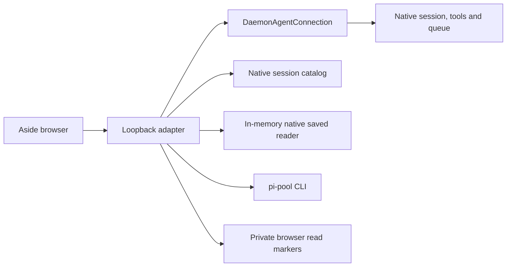

# Native session chat

`/what-did-i-say` and `/agent-chat` open Prime Agent in Aside. Run `/reload` in the terminal after updating the extension.

The browser reads native sessions and sends through `DaemonAgentConnection`. Prime Agent owns each run, queue, saved name, model and skill expansion. Closing or refreshing a browser never stops a worker.

## Layout and controls

```text
220px sidebar           40px header
Search                  Session title                 Refresh commands
Session title   2m      User and assistant messages
Session title   1h      Collapsed native tool details
                        Executing · 2m 12s
                        Queued messages
                        /skill:name User arguments
                        + Account Context Model Effort Stop Send
```

The sidebar contains top-level sessions only. F2 or the row's ellipsis opens rename. Enter saves through the native live or saved-session rename API. Escape cancels. Hover or focus shows the title, creation date, known last assistant response and model. Skill-only previews display `Untitled session` rather than injected markup. Names do not require model calls or scans of every history.

Select a session to change only the browser view. The terminal keeps its own selection. The URL fragment restores the selected session after reload. Draft text, images, text selection, scroll position and open disclosures survive session switches within the tab. Reload discards drafts and attachments.

The header has no permanent Idle line. Native work appears beside a compact spinner above the composer. Its elapsed time comes from native run-start messages, using the same backward scan as Pi's TUI. A reattach does not create a new start time. Compaction, retries, bash and child work keep their native distinctions. Missing start times have no timer.

Tools start collapsed. Tool-only assistant messages use compact 24-pixel summary rows without empty reply blocks. Each row shows its native name, status and short output summary. Expand to load exact arguments and output through the read-only tool endpoint. Collapsed transcript polls contain only summaries. Expanded live details reload when the native tool revision changes. Native tool events update partial output. Tool duration appears only when the native result supplies it. Reattached tools with no recorded duration do not get an invented timer. Thinking content stays hidden. Error-only and aborted assistant messages remain visible.

### Slash commands

Typing `/` opens the selected session's native command and resource catalogs. Search matches names and descriptions. Up/Down moves, Enter or Tab selects, and Escape dismisses. IME composition does not select or submit.

A skill inserts its real `/skill:name` prefix. The browser sends that invocation and its arguments unchanged, with attached images. Native Pi expands and stores the skill. The browser has no separate skill loader and does not claim multi-skill chip support.

`/model`, `/account`, `/effort`, `/rename`, `/stop` and `/compact` open or call the corresponding controls. Native extension entries keep their source label, but interactive extension commands require the terminal. Unknown slash commands retain the draft and never become model prompts. Native prompt templates can be sent.

Supported control invocations clear their own draft after the control opens or executes. Unknown and unsupported commands keep their draft.

The catalog refreshes on session selection, browser reload, a new `/` picker opening, or the header refresh button. Use refresh after terminal resource reloads while a picker remains open.

### Account, model, effort and context

The account widget loads the sanitized pool listing when the selected session or provider changes. Its compact label shows the effective next-request account, plan and session/week percentages used. `who --json --session ...` resolves that account through pi-pool. The widget never chooses a usable row, last-used account or seat itself. If resolution is unavailable, the widget says Pool unresolved. Current, pinned and seat flags remain separate menu details. A question mark means unavailable usage. Opening the menu refreshes the listing.

The model menu uses the native catalog, configured providers and current selection. Search and More models expose other native entries. It shows input support and native prices when supplied. `setModel()` also changes Prime Agent's default model; the menu states this. Model and effort changes require an idle native session, empty queue and no active children. Controls wait for native readback before displaying the new choice. Effort uses only `availableThinkingLevels`.

Account reads and selections call the existing `components/pi-pool/bin/pi-pool-token` with `execFile` argument arrays. `ls --json --provider ... --session ...` owns account usage and eligibility. `use ... --provider ... --session ...` sets only the selected session tree, followed by a fresh listing. There is no global pin or browser credential access.

A pin affects the next provider request. Follow the pool clears that pin. Unusable accounts require explicit force confirmation. The menu shows CLI status, plan, current/pinned/seat/live flags and percentages labelled used. Missing percentages remain unavailable. The CLI's `patched` field is not a host authentication-health verdict and is not displayed. Providers without a pool show No account pool. Account failures do not block chat.

Context is separate from account capacity. It shows native context estimates, session token totals and recorded cost. Missing data stays unavailable. Session usage covers the whole native saved file, including inactive branches and compaction, excluding attributed child usage.

### Stop, compact and queued prompts

Stop calls native abort and cancels the current turn and its active child runs. It also aborts active retry, bash or compaction. It does not kill a worker. Native queued input stays paused until the next normal prompt. Terminal aborts appear through native readback.

Compact calls the native compact API only while idle. The expandable queue lists native steering and follow-up messages. Edit and Remove use native expected-text checks. A changed queue rejects a stale edit rather than applying it to another message.

Message admission means Pi accepted the request. It does not establish task success. An uncertain send keeps its draft and never resends automatically. Repeating the unchanged request ID checks the same admission result.

### Read indicators

Running sessions show a spinner. An idle session with an unseen committed assistant entry shows a dot. A checked session shows neither. Failed workers, connection errors and unavailable read metadata remain explicit.

Pi currently has no native browser read record. This component stores only a baseline timestamp and last-read assistant entry per session at `getAgentDir()/browser-chat/read-state.json`. The first use treats older history as read. The file stays outside Git and native conversation history. Atomic rename and a process-owned lock protect concurrent listeners; markers never move backward in time. Reads do not rewrite the file. A damaged or locked read file does not prevent native chat.

A tab marks read only when native work is idle, it has foreground focus and the latest committed assistant response is visible at the bottom. A click on a session while scrolled up does not clear its dot. Reading in the terminal does not change browser markers.

The native catalog has no last-assistant field. The adapter caches observed entry metadata against catalog revisions. Each list refresh reads at most four changed recent sessions, rather than every saved history. Other pending response checks say unavailable until inspected. Native modification times invalidate the cache but never become assistant-response timestamps. Old sessions with no observed assistant entry show an unavailable reply date.

## Images and saved sessions

Paste, drop or upload PNG, JPEG, GIF or WebP with an image-capable native model. Limits are four images, 3 MiB each and 8 MiB total before base64 encoding. Image-only messages work. Unsupported saved images leave a `[Saved image]` placeholder. Markdown URLs and images stay inert.

Saved sessions are readable and renamable. Resume them in Prime Agent before sending or changing runtime controls. This slice adds no New, Resume, Archive or Fork flow.

## Native boundary


```mermaid
flowchart LR
    Aside[Aside browser] --> HTTP[Loopback adapter]
    HTTP --> Native[DaemonAgentConnection]
    Native --> Worker[Native session, tools and queue]
    HTTP --> Catalog[Native session catalog]
    HTTP --> Saved[In-memory native saved reader]
    HTTP --> Pool[pi-pool CLI]
    HTTP --> UI[Private browser read markers]
```

`src/chat-backend.ts` owns the thin native boundary. `src/chat-pool.ts` validates the CLI listing and selects through its CLI. `src/chat-read-state.ts` owns UI read markers. `src/chat-server.ts` validates loopback HTTP. `src/chat-client.ts` owns transient browser view state. `src/chat-page.ts` owns markup, styles and CSP hashes. `src/page.ts` renders inert Markdown, tool disclosures and images.

The adapter caches the immutable native tree inside each viewer connection by session identity and native leaf ID. Branch changes invalidate that tree. Full native user text supplies unnamed-session previews once the branch is already loaded.

The selected transcript polls every two seconds and the catalog every ten seconds while visible. The adapter keeps at most four native viewer connections. Those connections subscribe to native tool output but never own worker lifetime. Native snapshot reads rebuild the current run after disconnects. Saved reads use `SessionManager.inMemory()` to avoid migrating or repairing files on disk.

The native API has no atomic expected-session-ID or idle precondition for mutations. The adapter checks native identity and busy state before calls. A terminal session replacement or new turn between the check and call can still race. Avoid replacing that terminal worker's selected session while sending browser mutations.

## HTTP contract and security

All paths are below a random per-listener capability URL. Reads use `GET api/sessions`, `api/session?id=...`, `api/models?id=...`, `api/commands?id=...`, `api/accounts?id=...` and `api/tool?id=...&toolId=...`. Tool reads return exact native arguments and output only for calls on the selected branch.

Writes use `POST api/message`, `api/model`, `api/effort`, `api/rename`, `api/account`, `api/stop`, `api/compact`, `api/queue`, `api/read` and `api/close`. All require JSON, the page's write token, and exact loopback Host and Origin. Session paths and executable arguments never come from the browser.

The listener binds to `127.0.0.1`. A fixed-hash CSP allows no external resources or inline handlers. Transcript HTML stays escaped. Responses use `Cache-Control: no-store`. Do not share the capability URL. Other processes running as the same OS user are outside this protection.

Text is limited to 32,000 characters and request bodies to 12 MiB. Each listener remembers up to 256 send IDs. Reopen chat when that limit is reached. An inactive listener expires after 30 minutes. Reopening the extension command replaces its previous listener. Neither action stops native runs.

## Setup and checks

This component targets the pinned Prime Agent 0.9.4 SDK. The repository installer owns live registration. Workers must not apply or patch the live installation.

```sh
npm run typecheck --prefix components/user-history
npm test --prefix components/user-history
npm run test:native --prefix components/user-history
```

Set `HISTORY_TEST_ARTIFACTS_DIR` to the current session evidence directory. Native tests use an isolated HOME, daemon socket, skills and deterministic provider. They make no production model calls or pool writes.

For Aside checks, run `CHAT_TEST_BROWSER=1 node --import tsx --test test/chat-native.test.ts` from the component directory. The fixture writes `browser-ready.json`. The host opens that URL with Aside and records rendered desktop, narrow, dark-mode and keyboard checks. Unit tests alone do not establish browser verification.
