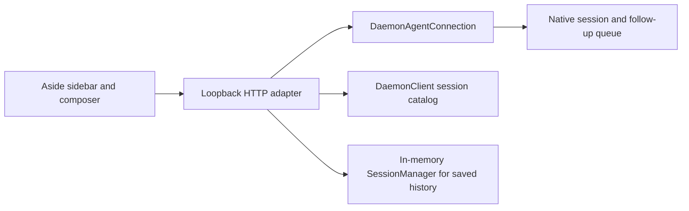
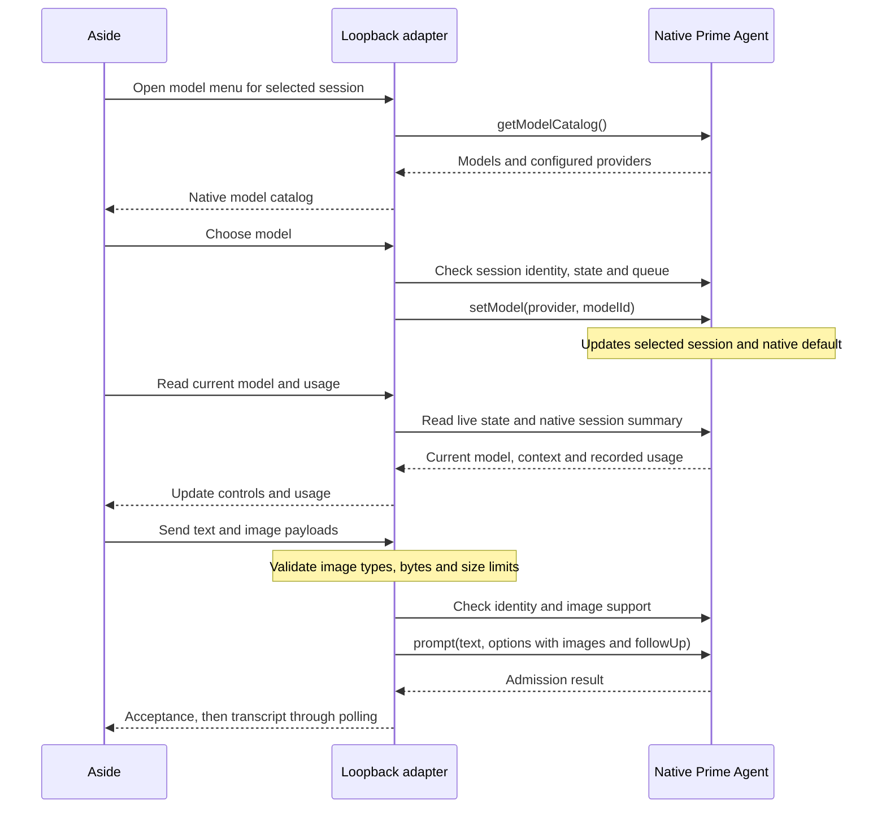

# Native session chat

`/what-did-i-say` opens an interactive view of Prime Agent sessions in Aside. `/agent-chat` opens the same view.
Run `/reload` in an existing terminal session after updating the extension.

The browser projects the native daemon catalog, active conversation branch, streaming message and follow-up queue.
It does not infer final responses or task completion. Assistant text appears in saved order, including replies without provider-specific final markers.
The native daemon owns prompt admission and execution. Opening the page does not call a model or rewrite history.

## Chat with sessions and agents

Run `/what-did-i-say` to open the active session in Aside. Use the left sidebar to switch sessions and the bottom composer to reply.

```text
Chats | Agents          Selected conversation             Usage
Search                  Saved messages, images and live replies
Conversation list       Image previews
                        Reply...
                        Attach                    Model v  Send
```

- Switch between daemon-visible sessions and agents in the sidebar. This changes the browser view, not the terminal's selected session. Private client-owned RPC sessions keep their native visibility limits.
- Send with Enter. Shift+Enter adds a line. Busy sessions receive native follow-up messages after their current turn.
- Saved sessions are readable. Resume them in Prime Agent before sending; the browser does not create or resume workers.
- Text and image drafts stay in browser memory for each session. Switching preserves them. Reloading or closing the tab discards them.
- Acceptance means Prime Agent accepted the message, not that the agent completed its work. An uncertain send keeps the draft and never resends automatically.
- Close chat stops the local browser connection. It does not stop agents. An inactive listener expires after 30 minutes without requests.
- Running either command again closes the previous listener owned by that extension. Existing tabs then become disconnected.

The extension uses the default native daemon socket. If you launch with a custom `--daemon-socket`, also pass `--agent-chat-socket` with the same path.

### Choose a model

Open the model menu beside Send. It shows the current model first, then models from configured providers. **More models** and search reveal the full native catalog. Unavailable entries stay disabled. Check authentication in Prime Agent to use them.

Model changes apply only to the selected live session while idle, with no queued messages or active retries. Saved sessions cannot change models. The browser does not interrupt a turn to switch models.

Native `setModel()` also updates Prime Agent's default model and provider. The menu warns about this side effect. Prime Agent owns catalog availability, authentication and selection; this package adds no model registry or account manager. After a change or uncertain response, the browser reads the current model before enabling another change.

### Read usage

Usage shows native recorded totals for this session's own work across the whole saved file, including inactive branches and compaction history. Input tokens include cache reads and writes. Output tokens and cost come from the same native summary. Totals exclude attributed child-agent usage.

Live sessions also show a separate context estimate against the selected model's context window. That estimate can be unknown after compaction. Saved sessions have no live context estimate.

Missing native totals display as not recorded, not zero. The native catalog also omits all-zero totals, so the browser cannot distinguish those cases. Provider account quotas, balances and rate limits are unavailable.

### Send and view images

Paste, drop or upload PNG, JPEG, GIF or WebP images. Choose a model that accepts images. Each message can contain up to four images, at most 3 MiB each and 8 MiB total before base64 encoding. Images-only messages are supported.

Remove an image from its draft preview before sending. Supported native user images appear in the transcript; click an image to enlarge it. Unsupported, malformed or over-limit saved image bytes stay out of previews. Each omitted block leaves a `[Saved image]` placeholder, including image-only messages. Markdown image URLs remain inert.

The adapter validates native image payloads and passes them through `prompt(..., { images })`. Prime Agent stores sent images in its existing session history. This package adds no image store or upload service.

### Native architecture


```mermaid
flowchart LR
    Aside[Aside sidebar and composer] --> HTTP[Loopback HTTP adapter]
    HTTP --> Native[DaemonAgentConnection]
    Native --> Prime[Native session and follow-up queue]
    HTTP --> Catalog[DaemonClient session catalog]
    HTTP --> Saved[In-memory SessionManager for saved history]
```

The package adds a browser page and an HTTP adapter. Prime Agent still owns session identity, saved history, model selection, usage and prompt admission. It adds no database, second history store, agent runner, copied session files, runtime patches or frontend framework.


```mermaid
sequenceDiagram
    participant Aside
    participant HTTP as Loopback adapter
    participant Prime as Native Prime Agent
    Aside->>HTTP: Open model menu for selected session
    HTTP->>Prime: getModelCatalog()
    Prime-->>HTTP: Models and configured providers
    HTTP-->>Aside: Native model catalog
    Aside->>HTTP: Choose model
    HTTP->>Prime: Check session identity, state and queue
    HTTP->>Prime: setModel(provider, modelId)
    Note over Prime: Updates selected session and native default
    Aside->>HTTP: Read current model and usage
    HTTP->>Prime: Read live state and native session summary
    Prime-->>HTTP: Current model, context and recorded usage
    HTTP-->>Aside: Update controls and usage
    Aside->>HTTP: Send text and image payloads
    Note over HTTP: Validate image types, bytes and size limits
    HTTP->>Prime: Check identity and image support
    HTTP->>Prime: prompt(text, options with images and followUp)
    Prime-->>HTTP: Admission result
    HTTP-->>Aside: Acceptance, then transcript through polling
```

`DaemonAgentConnection` reads the full native branch and current streaming message. The view omits thinking, tools and custom agent-to-agent messages. User and assistant text use the existing inert Markdown renderer. Saved reads use `SessionManager.inMemory()` and `setSessionFile()` because `SessionManager.open()` can repair or migrate files on disk.

The browser requests one selected transcript every two seconds and the session list every ten seconds while visible. It ignores responses for an older selection. The adapter keeps at most four native viewer connections, then disposes unused ones. Closing viewers does not kill or take ownership of sessions.

Before sending or changing models, the adapter resolves the selected session ID in the native catalog and checks the live session header. Model changes also check native busy state and queued input. Image sends check the current model's image support.

Prime Agent 0.9.4 has no atomic expected-session-ID or idle condition for these operations. A completed terminal session replacement is detected. A replacement, new turn or model change between the check and the native operation can still race. Avoid changing that worker's session or model in the terminal while submitting from the browser.

### Local access and limits

The listener binds only to `127.0.0.1`. The random URL grants read access. Writes also require a separate per-listener token, the exact Origin and Host, and JSON. Cross-site requests are rejected. Do not share the URL. Other processes running as your user are outside this protection.

The page's fixed script and stylesheet hashes restrict its Content Security Policy. It loads no outside resources. Transcript HTML, links and Markdown image destinations stay inert. Validated native raster images display through local data URLs. Chat responses use `Cache-Control: no-store`. Browser-managed copies and screenshots can still remain.

Each send carries a request ID. Repeated requests with the same ID, session, text and images reuse the admission result, including uncertain failures. A listener accepts at most 256 distinct send requests; reopen chat to reset it. Text is limited to 32,000 characters. The HTTP JSON body limit is 12 MiB, including base64 image data. There is no automatic send retry or daemon recovery loop.

The browser does not implement authentication setup, other model settings, interactive extension dialogs, new sessions, deletion or terminal commands. Use Prime Agent for those controls.

### Chat source map

- `extension/index.ts` registers both commands, opens Aside and closes its listener on native session shutdown.
- `src/chat-backend.ts` adapts public Prime Agent session, model and usage APIs.
- `src/chat-server.ts` exposes list, read, message and close routes, plus `GET api/models` and `POST api/model`.
- `src/chat-page.ts` contains the page, styles and fixed CSP hashes.
- `src/chat-client.ts` handles browser state, polling, model selection and image drafts.
- `src/chat-images.ts` validates native image payloads and selects supported saved user images.
- `src/page.ts` renders native message text, collapsed injected skills and validated images. It does not filter by response phase.
- `test/chat-server.test.ts` checks loopback HTTP, request limits and message authorization.
- `test/chat-native.test.ts` exercises the installed daemon with isolated synthetic sessions and a test provider.

## Layout and response rendering

The page follows the OpenAI Codex layout: a pale gray session sidebar, white conversation area, sans-serif text,
right-aligned user messages and a bottom composer with attachment, model and send controls.
The header shows native Running or Idle state. Saved sessions show Read-only and disable sending.
The sidebar collapses on narrow screens. Usage, models and connection errors remain available.

All saved user and assistant text on the active branch stays visible, including pre-compaction history.
The current native streaming message appears after saved entries. The view omits thinking blocks, tool calls and custom messages.
Injected skill instructions start collapsed. Their arguments remain visible.
A displayed reply, an idle worker or successful prompt admission does not establish task success.

## Package setup

This component targets Prime Agent 0.9.4. Both commands use its public SDK. Runtime dependencies and development dependencies are pinned in `package.json` and `package-lock.json`.

From the sieun-pi repository root:

```sh
cd components/user-history
node --version
npm ci --ignore-scripts
npm run typecheck
npm test
npm run test:native
```

Use Node 22.8.0 or later. The tests use the Node executable that runs npm. The `prime-agent` runtime dependency resolves from the official 0.9.4 R2 release, not a machine-local installation. Native tests resolve the CLI from that dependency. The test provider library is an explicit development dependency from the same release.

The sieun-pi root installer owns live registration. This component does not install a global extension itself. Its `pi.extensions` entry points to `extension/index.ts`, which registers both commands and the `--agent-chat-socket` flag. Link or install the whole component, not only `extension/`, so imports into `src/` keep working. The host installation must also resolve `prime-agent` and `marked` at runtime.

The component reads existing sessions through the daemon and native session files. Installation does not move, copy or reset histories. Credentials, runtime settings, test artifacts and session data are not package source.

## Verification

Use `npm run check` from the sieun-pi root for source checks. The chat tests cover inert Markdown, CSP hashes,
loopback access controls, drafts, stale responses, native usage, image validation and prompt admission.
`npm run test:native --prefix components/user-history` runs an isolated native daemon with a deterministic test provider.
It tests `/what-did-i-say`, switching sessions, saved read-only sessions, unmarked assistant replies, queued follow-ups and worker cleanup.
It makes no real model calls and sends no prompts to working sessions.

Set `HISTORY_TEST_ARTIFACTS_DIR` to the session evidence folder to keep native test output with the review.
Without it, artifacts go into the component's ignored `.test-artifacts` directory.

## Chat verification

Run `npm test` for unit and HTTP checks, then `npm run test:native` for the command through the installed CLI and daemon. Native tests use a synthetic HOME, an explicit test-owned socket, and a deterministic provider. They do not send prompts to your working sessions or call real models.

For Aside review, run:

```sh
CHAT_TEST_BROWSER=1 node --import tsx --test test/chat-native.test.ts
```

The test prints `CHAT_TEST_BROWSER_READY` and saves `browser-ready.json` under its test artifact directory. Open that URL through the Aside browser skill. Send a message to beta, switch to alpha, check saved read-only history, and close chat. Write the printed `browserDone` marker file within five minutes so the test can verify that viewers left its workers running and then remove its own daemon.

The native checks cover user-message and image persistence, live replies, queued follow-ups without interruption, selected-session isolation and stale selections after a terminal switch. They also check model selection, native usage, unchanged saved history and viewer cleanup. Browser review checks model and usage controls, image display, per-session drafts and saved read-only state. Narrow-screen layout requires its own visual check.
