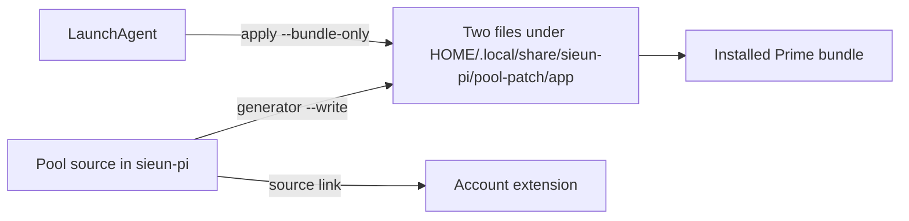

# Source installation decision

Use candidate A's manifest-driven source links.
Both independent designs reached that recommendation. The design judge scored A 9/10 and B 8/10.
Source links keep the installed agent code tied to the maintained files.

```text
sieun-pi source
    -> individual installed source links
    -> Prime extensions, Python skills and account-pool CLI

Existing profile and pool directories
    -> credentials, settings, logs and session state stay in place
```

Keep candidate B's duplicate-load check and ordinary settings files.
Keep manifest executable modes and explicit external dependency checks.
New profiles receive a settings template. Existing settings remain byte-for-byte unchanged.
Prime's native kernel bootstrap installs linked Python skills editable.
Bundle patching stays a separate explicit command with the pool patcher's own checks and backups.

Keep source links for skills, extensions and CLI code.
Use one generated copy for the launchd updater. Live verification changed this part of the original decision.
After the source moved under Documents, launchd's Python process returned `[Errno 1] Operation not permitted` and exited 2.
Interactive patching still worked. The service could not follow the source link into Documents.



The generator copies only `patch_prime_agent.py` and `pi-pool-status.js`.
The service skips extension reads and writes. It cannot retarget `/account` to the generated copy.
Stop the updater before refreshing these files, then load its generated plist.
Refresh the copy after patcher or helper edits. Agent source links still need no copy step.
This exception does not make settings, bundle patching, service activation or loaded processes atomic.
Do not move the standalone Claude skill-observability hook. It is not a Virev dependency.
The source-link investigator corrected that initial recommendation after checking its caller.

The judge identified one verification risk.
Changing HOME does not isolate the logged-in macOS Keychain.
Recovery tests must replace credential access with fixtures or deny access.
The real offline runtime check will only discover commands and skills, with no account commands or model request.
A fresh Prime process will verify installed source loading. Existing processes require reload or restart.
