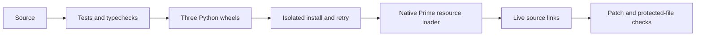

# Source installation verification

## Current public release, September 11

The public source is https://github.com/sieu-n/sieun-pi.
The clean root commit is `394aa56e801b9a951347b7d298a707ac372e502d`.
The non-global proof fix is `a4f0093e0b679e8918b124fa40c7ad50bb2c42f7`.

| Check | Verified result |
| --- | --- |
| Integrated source with new history UI | 581 tests, syntax/type checks and three Python wheels passed. |
| Updated packed artifact | 276 files, including both new history runtime modules. Global and non-global production installs passed native loading, repeat, update, rollback and uninstall. |
| Public Git installation | Passed with saved credentials, SSH and global/system Git configuration disabled. |
| Public installed native proof | Prime Agent 0.9.4, Node 25.9.0, 51 skills, four unique commands and two reloads. No `context` handler or status command. Zero provider network calls. |
| Public installed lifecycle | Separate Git-installed revisions passed repeat, update, rollback and uninstall. All seven seeded private-state files retained bytes and modes. The native proof profile was also rolled back through its receipt. |
| Application consumers | Public dependency installed through the repository wrapper. Reader and rendered Prime context view worked after nine old implementations were removed. |
| Daily recap runtime | Regenerated outside Documents. Existing private files and six protected files matched at the write boundary. The schedule was restored without a report run. A separate launchd help command exited 0 with no stderr. |
| Application Actions | Run `34589013666` passed installation, monorepo guards and earlier JS checks. It failed in search history continuation and crawler lint/type checks. Triage is in progress. |

The native proof expects `/account`, `/agent-chat`, `/what-did-i-say` and `/virev-reload`.
Its provider payload capture aborts before network access. This proves stable payload history, not a server-side cache hit.
The canonical history UI passed 77 unit/HTTP tests and both native command tests on Node 25.9.0 and 26.8.1.
Aside review checked model switching, native usage, image-only sending, enlargement, draft isolation, saved placeholders and read-only controls.
It used four synthetic calls and zero real calls. Closing the viewer preserved workers and saved bytes.
The desktop viewport was 1440 by 900 with no page overflow.
OS clipboard, file-picker dialogs, mobile visuals and authenticated Claude comparison remain untested.

Application follow-up run `34590417976` passed all JS checks and Python typechecks. Only crawler lint remained red.
Git and prior-run evidence attribute those diagnostics to prior or concurrent crawler changes. Their owners were notified where inbox delivery allowed.
The reviewed live plan changed seven targets and verified all 67 managed targets plus the existing pool bundle patches.
All six fresh protected-state fingerprints matched after apply, native loading and idle-root reload.
The live-profile loader found 81 skills: 51 managed definitions and 30 repository skills.
It registered all four commands once each, with no status command or `context` handler, across two reloads.
Its provider checks made zero network calls.
Three roots passed current-idle checks and completed native resource reload. Their command catalogs then resolved through user-global paths.
No workers were restarted. A fresh live repeat plan reported zero changes.

The UI commit `52ee0a4f273d4ba9564c38f8819adde951fce941` also passed anonymous Git installation and the installed native proof.
Its isolated profile was removed through the receipt. The proof fixture needs a Git boundary to exclude ancestor host skills.
Application legacy retirement is commit `b9bc5f64687f0dbc5959224c709229fb543a6381`.
Final [Actions run `34592276762`](https://github.com/sieu-n/auto-sns-agent/actions/runs/34592276762) passed at that retirement commit.
It passed JS checks, Python lint/typechecks/unit tests, and the configured PostgreSQL integration and replay tests.

## Historical migration, September 10

The following tables describe the original private migration against Prime Agent 0.9.4.
Their project-local registration and command counts are historical, not the current public design.

## 1. What it does

```text
sieun-pi
    -> 52 installed skill-directory links (51 definitions and one helper)
    -> global setup rules and model-role source
    -> account-pool source, command and extension links
    -> project-local Virev source links and project marker
    -> generated two-file updater runtime outside Documents

Existing HOME state directories
    -> settings, authentication, account data, logs and session history
```

The live plan changed 62 source targets and preserved the existing settings file.
All 63 managed targets verified. The three Python skill imports and auxiliary helper resolve to this checkout.

## 2. How it works



| Check | Result |
| --- | --- |
| Final source check | 336 tests passed, including 28 installer tests. TypeScript and syntax checks passed. |
| Python build | Websearch, linear-ticket and Aside browser wheels built from source. |
| Isolated installation | Apply and same-plan retry passed. Rollback restored managed targets. |
| Changed source after a plan | Apply rejected the changed source before changing targets. |
| Native resource loading | 51 skill definitions, both extensions and three commands loaded without errors across two passes. |
| Native implementation readiness | Registered Virev status callback reported generation 1 and the v2 implementation. |
| Watcher test | Replaced the test's overlapping directory observer with file-stat observation. Production watcher code stayed unchanged. |
| Copied Prime bundle | Guarded recovery passed 38 cases. Abort, registry, retry and patch round-trip checks passed. |
| Credential-test isolation | Python and Node guards rejected Keychain commands and remote network probes. Native fixture violation count was zero. |
| Live installation | Apply, same-plan retry and all 63 target checks passed. |
| Live package origins | Three packaged skills and the auxiliary helper resolve to `sieun-pi`. |
| Live patch | No pending replacements or missing anchors. Helper and extension match source. Both installed CLI paths passed. |
| Live bundle changes | Only the helper copy changed, to update its source-location comment. Bundle patch targets stayed unchanged. |
| Protected files | All six initial authentication, settings, models and pool-config digests remained unchanged. |
| Updater | Generated two-file runtime installed outside Documents. Real LaunchAgent run completed with exit 0, fresh bundle-only output, no new stderr and an unchanged extension link. |
| Secret scan | Gitleaks found no leaks in the staged source artifact. |

The native resource test uses the real Prime loader and a recorded UI callback.
It does not draw the TUI or send a model request.
The native pool tests use copied bundles, synthetic credentials and loopback fixtures.
Their guards are test sentinels, not an operating-system sandbox.

## 3. Current state against the final state

| Part | Final state | Today |
| --- | --- | --- |
| Maintained source | One private checkout | Source, locks, installer and tests live in `sieun-pi`. |
| Live setup | Source-backed links without moving account state | All 63 targets verify; all six protected-file digests match the baseline. |
| Automatic updater | A completed launchd run from accessible code | Exit 0 from the generated runtime; no macOS permission grant needed. |
| Rollback | Checked recovery for owned source targets | Isolated retry and rollback passed. Service and bundle rollback remain separate. |


- Existing Prime processes keep already loaded code until reload or restart. No Prime worker or Prime daemon was restarted.
- Live OAuth refresh, provider calls, Aside operations and Linear publication were not exercised.
- Full upstream Pi compatibility is not established.
- npm reports two high-severity entries through Prime's `extract-zip` dependency, with no available fix. See [dependency audit](security.md).
- At this historical checkpoint, redistribution rights were unresolved. The public release later removed unlicensed material and added scoped notices. See [provenance](provenance.md).
- `auto-sns-agent` now has intentional local source links and a project marker. Its Git history was not changed.
- The old pool directory retains its state and Git metadata. Make source commits in `sieun-pi`, not that old working tree.

## 4. Next steps, in order

1. Use a fresh Prime session or `/reload` to load command changes. The installer does not restart running sessions.
2. For another machine, install external tools and configure credentials separately. Run the isolated proof before live apply.
3. Recheck dependencies when Prime changes. Run the tests and `pi-pool patch --check` before updating the live host.

Receipts and original-source backups stay under `~/.local/state/sieun-pi/receipts/`.
The updater runs the generated patcher under `~/.local/share/sieun-pi/pool-patch/app`.
The source-owned generator copies only the patcher and helper. It does not load the service automatically.
Root reloaded only this updater and verified its first completed run.
Older permission-error stderr remains in the log history. Its timestamp did not change during the successful run.
The final source plan reported zero changes.


## Earlier pre-publication checks, September 11

The combined Virev and shared-utility run passed 150 tests.
The native proof passed on the installed Prime Agent 0.9.4 with Node 25.9.0.
It discovered 51 skills and registered `account`, `agent-chat`, `what-did-i-say`, and `virev-reload` once each across two reloads.
`virev-status` and the old `context` handler were absent.
The provider adapter proof preserved historical payload content and made zero network calls.
Its intentional capture exception stops before the request is sent; it is not a cache-hit measurement.

The production npm artifact passed installation, update to a separate prefix, repeat apply, rollback and uninstall.
An isolated pnpm 10.33.0 consumer also installed its production dependency graph.
The current-source secret scan found no leaks in 277 reviewed files.
The content review found no owner checkout paths or the removed personal account identifiers.
These counts describe this checkpoint. Recheck after the remaining source edits.

The poteto plan checker now checks verification structure without requiring a named model.
Its supplied skeleton passes the full checker, and omitting either active-source read still fails.
Three source-path tests passed.

These checks did not activate the live profile or publish the public repository.
The optional ticket-capture fix passed 19 tests, including six new rendering checks.
The new history UI handoff, final artifact check, app caller migration and live apply remain separate steps.
The history results above cover the imported baseline, not the pending UI iteration.
